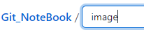
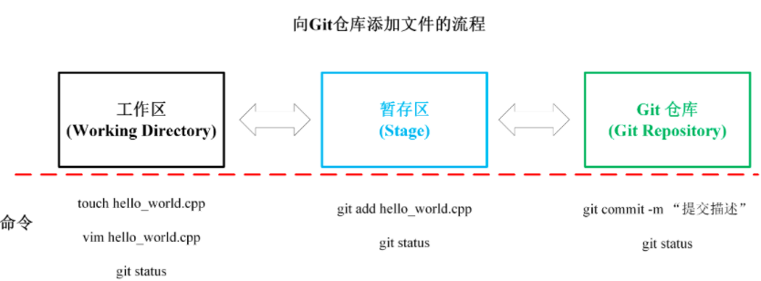
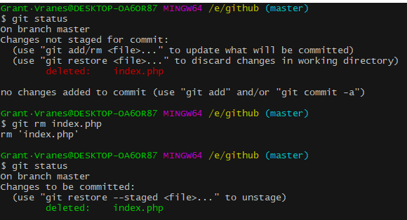
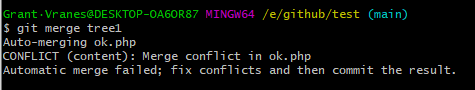
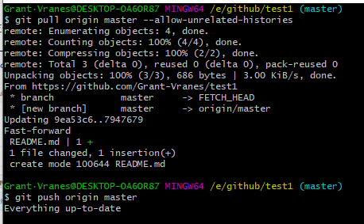
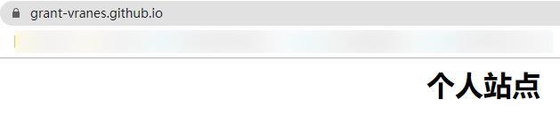

<p align = "center"><font color = "rgb(1,50,177)" size = "9">Github & Git</font></p>

<p align = "center" ><font color = "orange">瀑力汽水</font></p>


<hr/>

@[TOC]


<hr/>


## P1 使用Github（目的、基本概念、注册账号）

### 目的

​	借助github托管项目代码


### 基本概念

- 仓库（Repository）

  ​	仓库的意思，即你的项目，若想在github上开源一个项目，那就必须要新建一个Repository，如果你开源的项目多了，你就拥有了多个Repositories.

- 收藏（Star）

  ​	仓库主页star按钮，意思为收藏项目的人数

- 复制克隆项目（Fork）

  ​	你开源了一个项目，别人想在你这个项目的基础上做些改进，然后应用到自己的项目中，这个时候他就可以Fork你的项目（打开项目主页点击右上角的fork按钮即可），然后他的 Github主页上就多了一个项目，只不过这个项目是基于你的项目基础（本质上是在原有项目的基础上新建了一个分支），他就可以随心所欲的去改进，但是丝毫不会影响原有项目的代码与结构。

  ​	:warning:该fork的项目是独立存在的

  ​	

- 发起请求（Pull Request）

  ​	发起请求，这个其实是基于Fork的，还是上面那个例子，如果别人在你基础上做了改进后来觉得改进的很不错，应该要把这些改进让更多的人受益，于是就想把自己的改进合并到原有项目里，这个时候他就可以发起一个 Pull Request（简称PR），原有项目创建人，也就是你，就可以收到这个请求，这个时候你会仔细 review他的代码，并且测试觉得oK了，就会接受他的PR，你原有的项目就会拥有此改进。

  ​	

- 关注（Watch）

  关注后，此项目有任何更新，都会第一时间通知你

- 事务卡片（Issue）

  ​	发现代码BUG，但是目前没有成型代码，需要讨论时用；

  ​	同时也是问题的意思，举个例子，就是你开源了一个项目，别人发现你的项目中有bug，或者哪些地方做的不够好，他就可以给你提个issue，即问题，提的问題多了，也就是 Issues，然后你看到了这些问题就可以去逐个修复，修复ok了就可以一个个的cose掉。

- Github主页

  ​	账号创建成功或点击网址导航栏github图标都可进入 github主页：该页左侧主要显示用户动态以及关注用户或关注仓库的动态；右侧显示所有的git库。

  

  

- 仓库主页

  ​	仓库主页主要显示项目的信息，如：项目代码，版本，收藏/关注/fork情况等

- 个人主页

  ​	个人信息：头像，个人简介，关注我的人，我关注的人，我关注的git库，我的开源项目，我贡献的开源项目等信息


### 注册github账号

 	官方网址：https://github.com/

​		

<hr/>


<hr/>


<hr/>


### 注意

​	1、因为 github在国外服务器所以访问较慢或者无法访问，需要翻墙（shadowsocks）,但现在翻墙已被明令禁止，可以尝试修改dns；但一般都连的上。

​	2、私有仓库只能自己或者指定的朋友才有权限操作（私有仓库是收费的）

​	3、新注册的用户必须验证邮箱后才可以创建git库仓库（如果收不到，就设置一下qq的白名单）


## P2 使用Github（创建仓库、仓库主页说明）


## P3 使用github（仓库管理）

#### 查找文件

​	快捷键按 	**t**

​	


#### github创建文件夹


​		1）选择`Greate new file`创建新文件

​			

​		2）创建一个image文件夹只需要在后面加一个斜杠`/`，然后编辑一个文件保存

​			-->

​		:warning:注意：github不允许创建空文件夹，所以此文件夹必有文件；如果删除文件夹下面的所有文件，文件夹也会消失


#### 下载


:waning_crescent_moon:**如果使用git管理仓库，使用这个链接🔗就可以**


#### github issues

​		作用：发现代码BUG或者需要讨论的问题，但是目前没有成型代码，需要讨论时用；或者使用开源项目出现问题时使用


## P4 git

#### 1、git官网

​	https://www.git-scm.com/download/win

#### 2、安装


## P4 git基本工作流程

#### 1、git工作区域

​		


#### 2、像仓库中添加文件流程

​		

#### 3、流程

​		Git工作流程有：
​			(1) 在工作目录中添加、修改、删除文件；
​			(2) 将需要进行版本管理的文件放入**暂存区**；
​			(3) 将暂存区的文件提交到**Git仓库**中；

​		Git管理的文件三种状态对应Git工作流程：
​			(1) 已修改(modified)
​			(2) 已暂存(staged)
​			(3) 已提交(committed)

​		


## P5 git初始化及仓库创建和操作

#### 1、基本信息设置

```java
1、设置用户名
    git config --global user.name '用户名'
    
2、设置用户名邮箱
    git config --global user.email '邮箱'
  //注意：以上两项设置在github仓库主页显示谁提交了该文件
3、查看设置
    git config --list
```


#### 2、初始化一个新的git仓库

​	:waning_gibbous_moon:在命令行中的操作均为Linux语法

- 创建一个文件夹

  ​	

- 在文件夹内初始化git（创建git仓库）

  ​	

  

  #### 3、向仓库中添加文件

  - 先创建文件放在`.git`的同一文件夹下，也可在命令行中使用`touch 文件名（后缀）`来创建新文件

  

  

  - 接下来使用`git add 文件名`添加到**暂存区**，可以使用`git status`查看文件状态

    

  - 将文件从**暂存区**添加到**仓库**，使用`git commit -m '提交描述'`

    

    

#### 4、修改文件

- 编辑文件，可以使用`vi/vim 文件名`来编辑文件

  

- 重新使用`git add 文件名`添加到**暂存区**，可以使用`git status`查看文件状态

  

- 将文件从**暂存区**添加到**仓库**，使用`git commit -m '提交描述'`

  


#### 5、删除文件

- 先删除文件，可以使用`rm -rf 文件名`

  

- 将文件从暂存区中移除，使用`git rm 文件名`

  

- 提交操作，`git commit -m '提交描述'`

  


#### 6、查看历史记录

- 查看Git历史提交记录命令为： `git log` <font color = red>注意：这些操作只能在创建了仓库的文件夹中使用</font>

​		

- 简略查看：`git log --pretty=oneline`或`git log --oneline`可以查看简略版历史提交记录

  

  

- `git reflog` 查看历史记录，如下图所示，可以看到有 `HEAD@{0}` 和 `HEAD@{1}` 信息，其作用时方便后退到某一个版本，数字表示后退到当前版本需要多少步。预知如何可参看下集。

  :black_nib:**HEAD@{}中的{}中的数越大就代表版本越老**

  

  


#### 7、版本的前进与后退

​		**版本的前进和后退需要通过** **指针 HEAD** **来进行控制**。利用版本的前进与后退可用来找回已删除的文件

​		**HEAD控制的方式有三种：**
​			**(1) 使用版本号进行操作(常用)：**
​					命令格式为：`git reset --hard 版本号`

​					


​			**(2) 使用^符号进行操作，只能后退：**
​					命令： `git reset --hard HEAD^` 表示后退到第一个父提交上
​					命令： `git reset --hard HEAD^^` 表示后退到第二个父提交上

​					命令： `git reset --hard HEAD^n` 表示后退到第n个父提交上

​							

​			**(3) 使用~符号进行操作，只能后退：**
​					命令： `git reset --hard HEAD~` 表示后退一个版本；
​					命令： `git reset --hard HEAD~~` 表示后退两个版本；
​					命令： `git reset --hard HEAD~5` 表示后退5个版本；
​					命令： `git reset --hard HEAD~n` 表示后退n个版本；

​			**注：`HEAD~1` 中指的是后退的步数，`HEAD^1`指的是退到第几个父提交上。**

​			**注：命令参数有** **soft**, **mixed**, **hard**三种类型 
​					(1) 参数 **soft** 表示本地Git仓库移动**HEAD指针**。
​					(2) 参数 **mixed** 表示本地Git仓库移动**HEAD指针**，**重置暂存区**。
​					(3) 参数 **hard** 表示表示本地Git仓库移动**HEAD指针**，**重置暂存区，重置工作区**。


#### 8、删除文件

​		**git删除文件用到的命令有以下几种情况：**

​			1、命令：`rm 文件名` 表示删除的是工作区和暂存区的文件。

​			2、命令：`git rm 文件名` 表示删除的是工作区和暂存区的文件。

​			3、命令：`git rm -f 文件名` 表示当工作目录和暂存区的同一个文件存在不同内容时，执行命令 `git rm -f 文件名` 就可以强制删除工作区和暂存区的文件。

​			4、命令：`git rm --cached 文件名` 表示只删除暂存区的文件并且保留工作目录的文件。


#### 9、重命名文件

​		**重命名文件有来两种情况：**

​			1、命令：`mv 旧文件名 新文件名` 表示将工作区文件重命名，暂存区和仓库文件名不变。

​			2、命令(**常用**)：`git mv 旧文件名 新文件名` 表示将工作区和暂存区的文件重命名，仓库文件名不变。


#### 10、分支运用

​		**创建分支**命令格式：`git branch 分支名`

​		**查看分支**命令格式：`git branch -v`
​		也可以通过命令：`git log --decorate --all --oneline --graph` 对各个分支进行图形化显示。

​		

​		

​		**切换分支**命令格式：`git checkout 分支名`

​		

​	

​		**合并分支**命令格式：`git merge 分支名`

​		假若在分支tree1下创建了文件ok.php，当切换到主分支main时就看不到这个文件（如下图），所以就需要合并分支，这样main就能看到旗下分支tree1的文件，**注意**：若将tree1 分支合并到main分支，此时当前<u>分支状态</u>需要在main分支下。

​		

​		


>### 解决合并分支产生的冲突
>
>假若分支tree1合并到main下，此时两者的ok.php文件都是相同的 ，加入A用户对main分支下的ok.php文件进行修改然后提交到仓库，B用户对tree1分支下的ok.php进行修改然后提交到仓库。A和B同时对一个文件进行修改，那么修改的内容文件在再次进行分支合并时会产生冲突，系统就会报错，此时需要人工干预。
>
>下面通过实际操作来说明解决冲突。
>
>（1）main分支下修改 `ok.cpp` 文件，然后提交到仓库，结果如下图所示：
>
>
>
>（2）tree1分支下修改`test_sum.cpp`文件，然后提交到仓库
>
>
>
>（3）处于main分支下去合并tree1分支，此时报错，**虽然产生冲突，但是仍处于合并状态**
>
>
>
>（4）`vim ok.php`修改出冲突的文件，删掉<<<<<<< HEAD、、==\=\==\==、>>>>>>> tree1，重新保存
>
>
>
>（5）然后重新提交到暂存区，继续提交到仓库
>
>
>
>**总结**
>
>**下面对解决合并冲突进行总结：**
>
>**解决冲突的步骤(当前一直处于合并状态)：**
>
>1. 第一步：编辑文件，删除/修改冲突部分，保存退出；
>2. 第二步：重新提交文件至暂存区： `git add 文件名`
>3. 第三步：重新提交文件至仓库： `git commit -m “提交描述”`
>     **注意：** 此时commit后不能带具体的文件名，因为当前一直处在合并状态，默认提交的是当前冲突的文件。


**删除分支**合并分支结束后，可以删除分支，**删除分支**命令格式：`git branch -d 分支名`

​	


## P6 本地库与远程库

本地库文件推送(push)到远程库、远程库文件拉取(pull)到本地库

#### 1、建立本地库

- 新建自己用于存储本地库的文件夹，在文件夹中右击选择`Git Bash Here`

  

- 使用命令`git init`初始化本地库

  

  

#### 2、建立远程库


#### 3、本地库推送（push）到远程库（github）

```java
命令格式为：git push origin 分支名	//前提你需要在github创建了一个仓库
    							 //表示将本地库该分支下文件推送到远程库
```


> 上图产生了错误，是因为origin并没有设置，origin代表的是远程仓库地址的别名。此时设置origin如下
>     1、切换到.git/目录，编辑config文件
>
> ​			
>
> ​	2、添加``[remote "origin"]``选项
>
> ​			
>
> ```java
> 注：以上两步骤，可以直接使用命令（推荐）	
>     git remote add origin GitHub仓库地址 //表示将github地址命名为origin
>     
>     //删除本地指定的远程地址的别名
>     git remote remove origin
> ```
>
> ​	3、再次执行（将本地库下的master分支推送到github），成功
>
> ​			
>
> ​	4、github上就收到了pull request的请求
>
> ​	5、切换master分支，旗下就有本地创建的file.html文件
>
> ​			

<hr/>

如果我在远程仓库github的master分支下添加README.md文件，而本地master分支下不做改变


此时如果将本地库的master分支推送到github，就会报错，因为远程库一个README.md文件在本地库没有，此时需要将远程库README.md拉取(pull)到本地库(更新)，然后再推送到远程库，即可成功


解决办法：执行命令`git pull origin master --allow-unrelated-histories`




#### 4、远程库克隆（clone）到本地

###### 目的

​	将远程仓库（github对应的项目）复制到本地

###### 代码操作

```java
git clone 仓库地址
```


###### 将本地仓库同步到远程仓库中

```jaca
git push
```

如：在本地创建info.php文件，将其同步到远程仓库中


<hr/>

> 思考：如果无法同步或者没有权限
>
> 解决：
>
> ```java
> 私有项目，没有权限，输入用户名密码，或者远程地址采用这种类型：
>     vi config //移动到.git下，编辑config
>     将[remote "origin"]
>     	url = https://github.com/用户名/仓库名.git
> 	修改为
>         url = https://用户名:密码@github.com/用户名/仓库名.git
> 	//用户名密码是github的账户名和密码
> ```


#### 5、远程库拉取（pull）到本地

​		命令： `git pull origin 分支名` ，origin为远程库地址的别名。

​		将远程库文件更新到本地库，本地工作区文件将会更新，如果本地有和远程库同名的文件，将会强制更新本地库文件


## P7 github pages 搭建网站

#### 个人站点

​		**1、访问**

​			`https://用户名.github.io`

​		**2、搭建步骤**

​				1）创建个人站点	->	新建仓库（注：仓库名必须是用户名[^Owner].github.io）

​						

​				2）在仓库下新建index.html的文件即可，以下为测试代码

​						

​				3）输入`https://grant-vranes.github.io/`（大写会被忽略，没有影响）

​						


